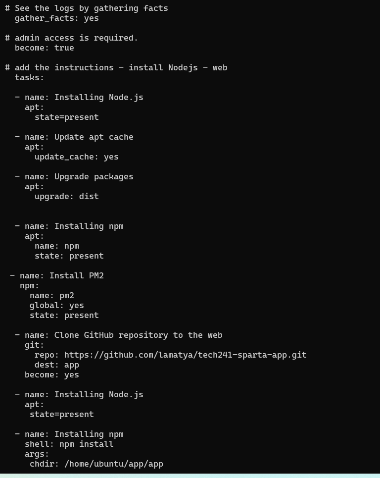
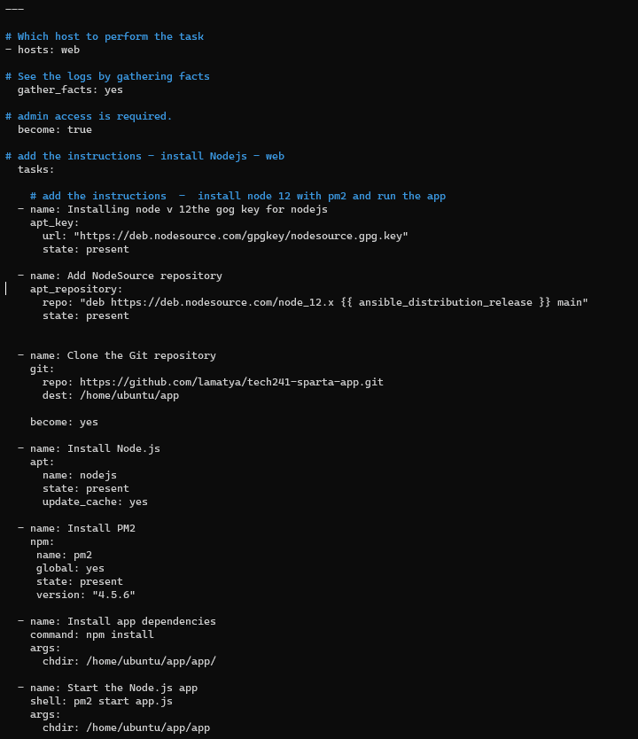
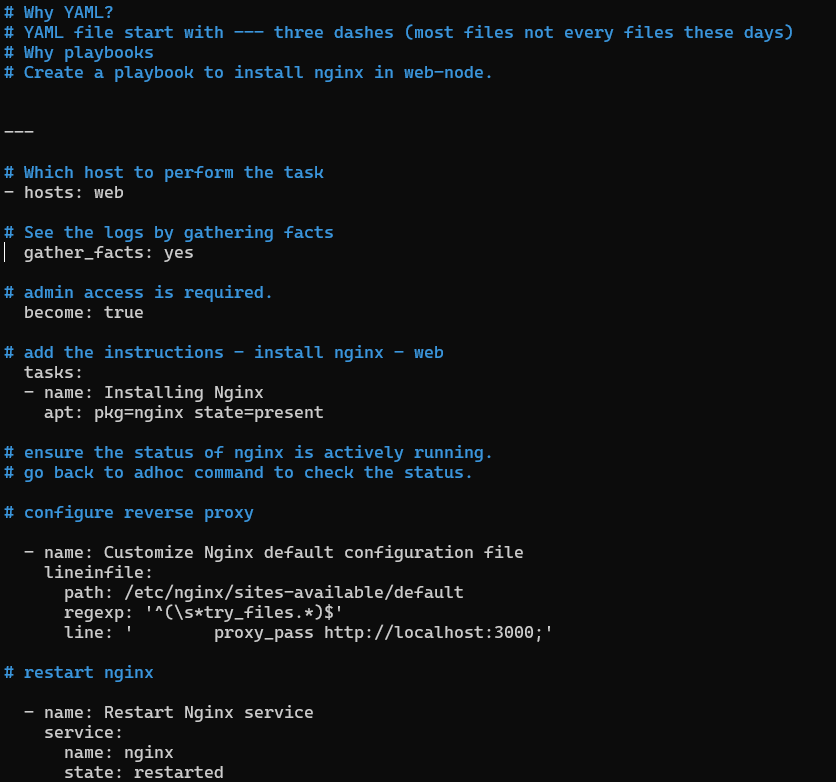
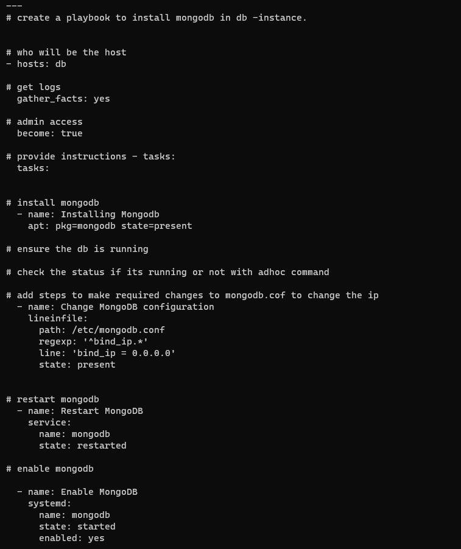

# IaC
Infrastructure as a code is where we codify everything. We are turning our requirements and tasks into code that can be executed by computers. This allows us to automate processes, reuse scripts, and manage our infrastructure efficiently. 
# Ansible 
Ansible is a open source configuration management tool is highly used in the DevOps community due to its simplicity, lightweight nature, and agentless architecture. 


# Steps to install software properties
## On ansible Controller Terminal

1.	**sudo apt update -y**: Updates the package lists on your system.

2.	**sudo apt upgrade -y** -Upgrades 

3.	**sudo apt-get install software-properties-common**: Installs the software-properties-common package, which provides an abstraction for managing software repositories.


4.	**sudo apt-add-repository ppa:ansible/ansible**: Adds the Ansible repository again 

5.	**sudo apt update -y**: Updates the package lists again to include the newly added Ansible repository.

6.	**sudo apt install ansible -y**: Installs Ansible.

7.	**ansible --version**: Verifies the version of Ansible after installation.

8.	**cd /etc**: Changes the working directory to /etc.

9.	**cd ansible/**: Changes the working directory to ansible within /etc.


10.	**pwd**: Prints the current working directory (/etc/ansible).


11.	**cd ~/.ssh**: Changes the working directory to the .ssh directory within the user's home directory.


12.	**ls**: Lists the files and directories in the current directory (~/.ssh).

13.	**sudo nano tech241.pem**: Opens the tech241.pem file in the nano text editor.


14.	**sudo chmod 400 tech241.pem**: Changes the permissions of tech241.pem file to read-only for the owner.

15.	**exit**: Exits the current shell or terminal session.


16.	**sudo ssh -i "tech241.pem" ubuntu@ec2-3-250-60-81.eu-west-1.compute.amazonaws.com:** Initiates an SSH connection to the specified host using the tech241.pem private key file.


17.	**sudo ssh -i "tech241.pem" ubuntu@ec2-54-171-218-2.eu-west-1.compute.amazonaws.com:** Initiates another SSH connection to a different host using the tech241.pem private key file.


18.	**sudo nano hosts**: Opens the hosts file in the nano text editor.

19.	**Add this on the hosts file:** By adding this entry, it reference the "web" group or the specific EC2 instance in the Ansible playbooks or commands to perform tasks on that host.
```
[web]
ec2-instance ansible_host=ip ansible_user=ubuntu ansible_ssh_private_key_file=~/.ssh/tech241.pem

[db]
ec2-instance ansible_host=ip ansible_user=ubuntu ansible_ssh_private_key_file=~/.ssh/tech241.pem
```

20.	**sudo ansible web -m ping**: Executes the Ansible ping module on hosts belonging to the web group in the inventory.

And if it working when we do the ping command we should see this;


### For the app and db instance:

1. sudo apt update -y
2. sudo apt upgrade -y

Both instance will need the update and upgrade command before we do the ping command. 


# Adhoc Commands

sudo ansible web -a "uname -a" - checks the OS version

sudo ansible web -a "date" - checks the timezone 

sudo ansible web -a "free" - checks the free space

sudo ansible web -a "ls -a" - lists the packages installed

# Playbook

### Why YAML?

Its readability and ease of use make it ideal for various applications, such as defining Ansible playbooks, Docker, Kubernetts. 

### YAML file start with --- three dashes (most files not every files these days)

### Why playbooks

In simple words, playbooks are a set of instructions or tasks written in a specific format to automate and manage the configuration and deployment of software on multiple computers or servers. They are commonly used with Ansible, a popular automation tool.

### Create a playbook to install nginx in web-node.
```
---

# Which host to perform the task
- hosts: web

# See the logs by gathering facts
  gather_facts: yes

# admin access is required.
  become: true

# add the instructions - install nginx - web
  tasks:
  - name: Installing Nginx
    apt: pkg=nginx state=present

# ensure the status of nginx is actively running.
### go back to adhoc command to check the status.
```
# Playbook -nodejs/npm Automating app




1. Install Node.js on the server.

2. Clone the GitHub repository containing the app to the /home/ubuntu/app directory.

3. Install npm (Node Package Manager) on the server.

4. Run npm install in the /home/ubuntu/app/app directory to install the app's dependencies.

5. Start the application by running npm start in the /home/ubuntu/app/app directory.

# Automating the app with pm2



```
1. It adds the NodeSource repository to the server to get Node.js version 12.x.

2. It clones the Node.js application's code from a GitHub repository to the server.

3. It installs Node.js on the server using the NodeSource repository.

4. It installs PM2, a process manager for Node.js applications, with a specific version.

5. It installs the dependencies required for the Node.js application using NPM.

6. It starts the Node.js application using PM2.
```

# Using Playbook to install and configure Nginx and setting up reverse proxy



# Playbook for installing mongodb on database

### Create a playbook to install mongodb; To create playbook use command sudo nano mongodb-playbook.yml 


### Install mongodb using the command; **sudo ansible-playbook mongodb-playbook.yml**


### Once you install check the status of mongodb using the command; sudo ansible db -a "systemctl status mongodb"


# Adding bindip to 0.0.0.0



1. Change MongoDB Configuration:

The task modifies MongoDB's configuration to allow it to accept connections from any IP address (0.0.0.0).

2. Restart MongoDB:

After changing the configuration, the task restarts MongoDB so that the changes take effect.

3. Enable MongoDB:

The task ensures MongoDB is enabled, so it automatically starts whenever the server boots up.

# On the App Vm Create a environemnt variable


Sure, here's a simplified explanation of each command:

1. SSH to your app VM and go to your app folder to create environment variable;

2. sudo nano /etc/environment: Opens the /etc/environment file using the nano text editor with administrator privileges, likely to modify system-wide environment variables.

3. ps aux | grep PM2: Lists all running processes and filters the output to show only processes containing the string "PM2." This helps to identify PM2-related processes.

4. sudo kill -9 3562: Terminates the process with ID 3562 forcefully. 

5. sudo node seeds/seed.js: Executes the Node.js script seed.js located in the seeds directory.

