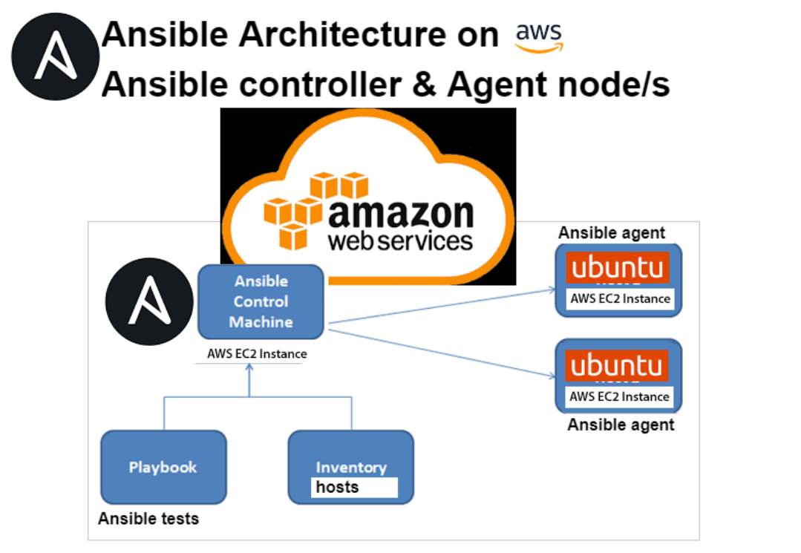

# IaC
Infrastructure as a code is where we codify everything. We are turning our requirements and tasks into code that can be executed by computers. This allows us to automate processes, reuse scripts, and manage our infrastructure efficiently.
# Ansible 
Ansible is a open source configuration management tool is highly used in the DevOps community due to its simplicity, lightweight nature, and agentless architecture. git 



# Steps to install software properties
## On ansible Controller Terminal

1.	**sudo apt update -y**: Updates the package lists on your system.

2.	**sudo apt upgrade -y** -Upgrades 

3.	**sudo apt-get install software-properties-common**: Installs the software-properties-common package, which provides an abstraction for managing software repositories.


4.	**sudo apt-add-repository ppa:ansible/ansible**: Adds the Ansible repository again 

5.	**sudo apt update -y**: Updates the package lists again to include the newly added Ansible repository.

6.	**sudo apt install ansible -y**: Installs Ansible on your system.

7.	**ansible --version**: Verifies the version of Ansible after installation.

8.	**cd /etc**: Changes the working directory to /etc.

9.	**cd ansible/**: Changes the working directory to ansible within /etc.


10.	**pwd**: Prints the current working directory (/etc/ansible).


11.	**cd ~/.ssh**: Changes the working directory to the .ssh directory within the user's home directory.


12.	**ls**: Lists the files and directories in the current directory (~/.ssh).

13.	**sudo nano tech241.pem**: Opens the tech241.pem file in the nano text editor with superuser (sudo) privileges.


14.	**sudo chmod 400 tech241.pem**: Changes the permissions of tech241.pem file to read-only for the owner with superuser privileges.

15.	**exit**: Exits the current shell or terminal session.


16.	**sudo ssh -i "tech241.pem" ubuntu@ec2-3-250-60-81.eu-west-1.compute.amazonaws.com:** Initiates an SSH connection to the specified host using the tech241.pem private key file.


17.	**sudo ssh -i "tech241.pem" ubuntu@ec2-54-171-218-2.eu-west-1.compute.amazonaws.com:** Initiates another SSH connection to a different host using the tech241.pem private key file.


18.	**sudo nano hosts**: Opens the hosts file in the nano text editor with superuser privileges.

19.	**Add this on the hosts file:** By adding this entry, it reference the "web" group or the specific EC2 instance in the Ansible playbooks or commands to perform tasks on that host.
```
[web]
ec2-instance ansible_host=ip ansible_user=ubuntu ansible_ssh_private_key_file=~/.ssh/tech241.pem

[db]
ec2-instance ansible_host=ip ansible_user=ubuntu ansible_ssh_private_key_file=~/.ssh/tech241.pem
```

20.	**sudo ansible web -m ping**: Executes the Ansible ping module on hosts belonging to the web group in the inventory.

And if it working when we do the ping command we should see this;


