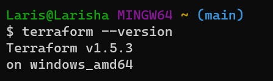

# Terraform

Terraform is an open-source infrastructure as code (IaC) tool developed by HashiCorp. Terraform provides a simple and consistent way to manage cloud providers, on-premises resources, and other infrastructure components, making it easier to maintain and reproduce complex environments.

# Why use Terraform- Its Benefits

1. Infrastructure as a Code (IaC): Define your infrastructure using easy-to-understand code.

2. Manage Anywhere: Work with multiple cloud providers (AWS, Azure, GCP, etc.) and on-premises environments. This allows you to manage infrastructure across different clouds using a single configuration.

3. Automate Everything: Terraform handles the setup and updates for you.

4. Be Consistent: Ensure your infrastructure is always the same, no surprises.

5. Save Time: Reuse code and use existing resources from others.

6. Learn Easily: Its language is beginner-friendly.

7. Work Seamlessly: Integrate with your development process for smooth operations.

# Who is using Terraform

Terraform is used by various organizations, ranging from startups to large enterprises. Many technology companies, including Airbnb, GitHub, HashiCorp, and Uber, use Terraform to manage their infrastructure efficiently.

# How to Install Terraform

1. Download the Terraform from the official website: https://www.terraform.io/downloads.html
   
2. Download the windows AMD64 version of Terraform.
   
3. Once downloaded right-click the zip file and select "Extract All". Choose a destination folder where you want the folder to be.

# Add Terraform to System PATH:
To use Terraform from any command prompt, you need to add the folder where the Terraform  is located to your system's PATH environment variable.

1. Open the Start menu and search for "Environment Variables.
   
2. Click on "Edit the system environment variables."
In the System Properties window, click the "Environment Variables" button.

3. Under the "System variables" section, find the "Path" variable and click "Edit."
   
4. Click "New" and add the path to the folder where the Terraform binary is extracted (C:\Users\Laris\terraform_1.5.3_windows_amd64). 
   
5. Click "OK" to save the changes.
   
# Verify the Installation: 

1. Open a new Terminal (Gitbash) window.
2. Type terraform --version and press enter.
3. If it has been entered correctly and added to the path, it will then display the verison installed. 

