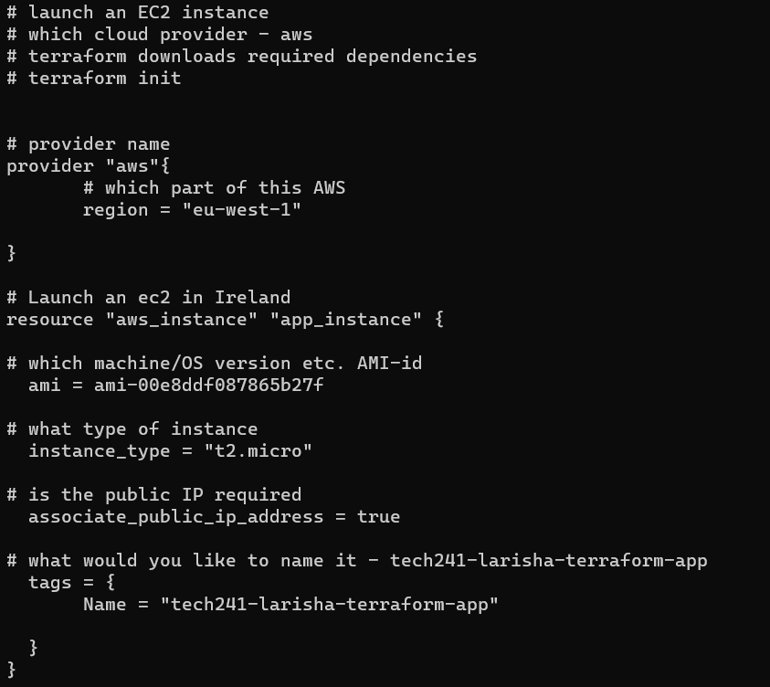
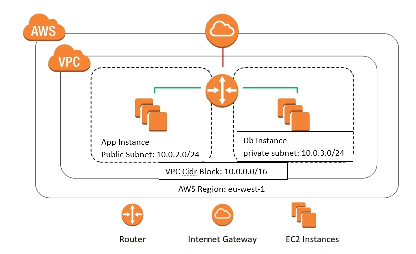

# Terraform

Terraform is an open-source infrastructure as code (IaC) tool developed by HashiCorp. Terraform provides a simple and consistent way to manage cloud providers, on-premises resources, and other infrastructure components, making it easier to maintain and reproduce complex environments.

# Why use Terraform- Its Benefits

1. Infrastructure as a Code (IaC): Define your infrastructure using easy-to-understand code.

2. Manage Anywhere: Work with multiple cloud providers (AWS, Azure, GCP, etc.) and on-premises environments. This allows you to manage infrastructure across different clouds using a single configuration.

3. Automate Everything: Terraform handles the setup and updates for you.

4. Be Consistent: Ensure your infrastructure is always the same, no surprises.

5. Save Time: Reuse code and use existing resources from others.

6. Learn Easily: Its language is beginner-friendly.

7. Work Seamlessly: Integrate with your development process for smooth operations.

# Who is using Terraform

Terraform is used by various organizations, ranging from startups to large enterprises. 

- Netflix

- Airbnb

- HashiCorp

- GitHub

- Adobe

# How to Install Terraform

1. Download the Terraform from the official website: https://www.terraform.io/downloads.html
   
2. Download the windows AMD64 version of Terraform.
   
3. Once downloaded right-click the zip file and select "Extract All". Choose a destination folder where you want the folder to be.

# Add Terraform to System PATH:
To use Terraform from any command prompt, you need to add the folder where the Terraform  is located to your system's PATH environment variable.

1. Open the Start menu and search for "Environment Variables.
   
2. Click on "Edit the system environment variables."
In the System Properties window, click the "Environment Variables" button.

3. Under the "System variables" section, find the "Path" variable and click "Edit."
   
4. Click "New" and add the path to the folder where the Terraform binary is extracted (C:\Users\Laris\terraform_1.5.3_windows_amd64). 
   
5. Click "OK" to save the changes.
   
# Verify the Installation: 

1. Open a new Terminal (Gitbash) window.
2. Type terraform --version and press enter.
3. If it has been entered correctly and added to the path, it will then display the verison installed. 

# Infrastructure as Code (IaC) Terraform.

Terraform: Use Terraform to create the initial infrastructure on AWS or any cloud provider. This includes resources like VPC, subnets, security groups, and any other necessary components for your environment. Terraform ensures the infrastructure is set up correctly according to the specified configuration.

Ansible: After the initial infrastructure is provisioned by Terraform, use Ansible to configure the instances created by Terraform. Ansible playbooks can be used to install and update software, manage configurations, and perform other necessary tasks on the instances. Ansible works at a higher level and operates on the already provisioned infrastructure.

# Commands used to run Terraform:

1. printenv aws_access_key_id: Displays the value of the AWS access key used for authentication.

2. printenv aws_secret_access_key: Shows the value of the AWS secret access key.

3. mkdir terraform-tech241: Creates a new folder named "terraform-tech241" to organize Terraform files.

4. cd terraform-tech241: Moves into the "terraform-tech241" folder to work on your Terraform configuration.

5. nano main.tf: Opens the "main.tf" file in a text editor.
   
6. cat main.tf: Displays the contents of the "main.tf" file so you can see what's inside. This is just to make sure it has been saved correctly.

7. terraform init: Initializes Terraform in the current directory, preparing it to work with AWS.

1. terraform plan: Generates an execution plan, showing what changes Terraform will make to AWS infrastructure without actually applying them.

   

9. terraform apply: Applies the changes defined in  Terraform configuration to create or modify AWS resources based on the plan. 

10. terraform destroy: Destroys all the AWS resources created by Terraform in the main.tf.

# How to Launch an EC2 instance using Terrafom 

1. Make a directory using the command Mkdir "terraform-tech241"
2. Create a file inside the directory "nano main.tf"
3. Inside the file write the script. 

4. Once the script has been created using the command "Terraform apply" will create the EC2 instance if all the information provided have been configured correctly. It will ask you to input the value "yes" and enter.

# Create VPC using Terraform

# Port rules for app and db

## app

## db

# Steps to Create VPC with Terraform

1. CIDR block 10.0.0.0/16

2. Create internet gateway.

3. Attach to VPC.

4. Input Subnets.

5. Create route tables (public)

6. Add routes

7. Add the VM

